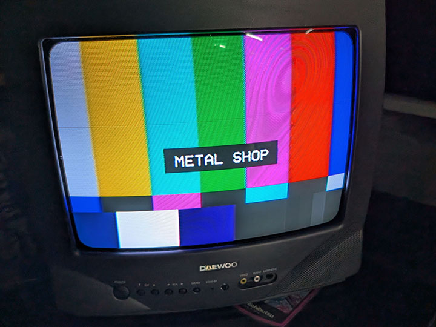

# NTSC Test Pattern Generator (`bars`)

A Raspberry Pi appliance that outputs NTSC color bars and other test
patterns over composite video, controlled from the keyboard or a
compatible USB remote control.

Built for a Raspberry Pi 3B+ running Raspberry Pi OS Bookworm, output via
the analog composite video/audio jack to a CRT.



## Keyboard controls

| Key | Action |
|---|---|
| `←` / `→` | Change pattern (cycles through all patterns) |
| `I` | Toggle IP address overlay |
| `H` | Toggle hostname overlay |
| `C` | Toggle custom text overlay (default "CUSTOM TEXT", editable in `settings.ini`) |
| `T` | Toggle 1kHz tone (0dBFS) through the analog audio output |
| `U` | Toggle underscan (default off) |
| `Q` / `Esc` | Quit to shell |

Default pattern on launch: whichever file sorts first in `patterns/` (the
lowest `BARS_NNNN_` prefix) — currently `BARS_0000_Bars.png`.

## Remote control

Tested with a "Fm4 2.4G Universal Remote Control" (identifies itself over
USB as `XING WEI 2.4G USB`). Like most of these, it enumerates as several
separate HID sub-devices (base keyboard, Consumer Control, System
Control) rather than one — `bars.py`'s input-device discovery already
accounts for this by grabbing every `/dev/input` device that has an
`EV_KEY` capability, not just ones that look like a full keyboard, so no
extra setup is needed beyond plugging it in.

| Button | Action |
|---|---|
| Power | Disabled — does nothing (see the logind step in "Installing" below for why it doesn't shut the Pi down) |
| Home | Quit to shell (same as `Q`/`Esc`) |
| Menu | Disabled — does nothing (the menu/help screen was removed) |
| Left / Right | Change pattern (same as arrow keys) |
| Up / Down | Cycle the overlay: none → IP address → hostname → custom text → none |
| Back | Toggle underscan (same as `U`) |
| Volume Down | Turn the tone off |
| Volume Up | Turn the tone on |

If you're wiring up a different remote, its button-to-keycode mapping is
not something you can guess from the box — capture it with `evdev`
directly: `evdev.list_devices()` to enumerate its sub-devices, then read
`EV_KEY` events off each one while pressing buttons one at a time. Also
note that `/dev/input/eventN` numbering is not stable across reboots, so
don't hardcode device paths — filter by capability instead (as
`find_keyboard_devices()` in `bars.py` does).

## McBrain fleet integration

BARS also runs as an assignable app on a [McBrain](https://github.com/LawtonBarnes/mcbrain)
fleet, supervised by [STRINGS](https://github.com/LawtonBarnes/strings)
instead of being launched by hand. One extra piece exists purely for
that context: an `--identify` flag (`bars --identify`) that forces the
hostname overlay on at startup, since puppets have no keyboard/remote
of their own to press `H` with -- STRINGS/SCRUTE use this to broadcast
a "flash your hostname" command to every puppet at once, for matching a
physical CRT to its Pi during cabling. Standalone (non-fleet) use is
unaffected; this flag is a no-op unless something explicitly passes it.

## Pattern levels (how these differ from broadcast SMPTE bars)

The patterns are built for what the Pi's composite output actually does,
not copied from broadcast specs. The main rule is **RGB 0 is black**.

- **The Pi adds the 7.5 IRE setup itself.** With the default
  `sdtv_mode=0` (US NTSC), the firmware outputs RGB 0 at 7.5 IRE, so the
  patterns must not also build that pedestal in. Earlier patterns put
  black at about RGB 20, which counted setup twice and made every other
  app look too bright after calibration. Every app on the fleet uses
  RGB 0 for black, and so do the patterns.
- **There's no blacker-than-black.** The Pi can't output anything below
  RGB 0, so a true SMPTE PLUGE (−4% / 0 / +4%) is impossible. Both the
  PLUGE pattern and the PLUGE strip under the color bars use **RGB 8**
  (about +3%) and **RGB 16** (about +6%) on an RGB 0 background. In the
  color bars' strip the order is 8 | 0 | 16, so each bar has black on
  both sides.
- **The framebuffer is 16-bit (RGB565).** There are only 32 grey levels,
  and a grey that isn't a multiple of 8 gets a faint green tint near
  black. Near-black values in the patterns are multiples of 8. The
  Step-Wedge pattern deliberately includes 4, 12, 20 and 28 so you can
  see this on the CRT.
- **Colors are capped at 75%.** The color bars and every row of
  Color-Scale top out at RGB 191, which keeps composite peaks around
  100 IRE. The full-field Red, Green and Blue purity patterns are the
  only saturated 255 colors.
- **Horizontal lines are at least 2 px tall.** The output is 480i, so a
  1-pixel line lands in one field only and flickers at 30 Hz.
- **Geometry is pre-stretched for 4:3.** 720x480 is shown on a 4:3
  screen, so each pixel is about 11% narrower than it is tall. Circles
  and grid cells are drawn 1.125x wider than tall so they look round and
  square on the CRT, and the photos are already squeezed to match.

The master for all patterns is a layered PSD kept outside the repo. Edit
there, then export 720x480 8-bit RGB PNGs into `patterns/`.

## Adjusting a CRT

Warm the set up for 15–20 minutes and set the room lighting you'll
normally watch in. Then:

1. **Brightness (PLUGE):** turn brightness down until the whole PLUGE
   area is black, then bring it up slowly until the **RGB 8** bar is
   just barely visible. Stop there. The **RGB 16** bar should be clearly
   visible and the background should still be black. This works
   differently from broadcast PLUGE, where you match the sub-black bar
   to black: here there's no sub-black bar, so you aim for
   "barely visible."
2. **Contrast (PLUGE's white block or White):** raise contrast until
   whites are bright, but stop before they bloom, smear, or the picture
   size starts to change. Check the grey blocks still step evenly.
3. **Recheck brightness,** because contrast and brightness affect each
   other.
4. **Color and tint (color bars, blue-only):** switch the set to
   blue-only if it has that mode. You'll see four lit bars: grey, cyan,
   magenta and blue. Adjust color (saturation) until the two outer bars
   (grey and blue) match the small strip directly below them. Then
   adjust tint (hue) until the two inner bars (cyan and magenta) match
   theirs. Go back and forth until all four match. Sets without blue-only mode can only be judged by
   eye on the bars and Skin-Tones.
5. **Check:** Gray-Scale and Step-Wedge should step smoothly, with the
   near-black steps just separated from black. Nat-Geo, Skin-Tones and
   Adams give a real-picture sanity check.

Geometry and convergence use Safe-Title, Alignment, Grid and Convergence.
Skip color and tint on black-and-white sets.

## Files

- `bars.py` — the program. Deployed to `/opt/bars/bars.py` on the Pi.
- `patterns/*.png` — test pattern images, 720x480. Deployed to `/opt/bars/patterns/`.
  Add or remove patterns by dropping/deleting files matching `BARS_*.png`
  in this folder — `bars.py` globs for that pattern at startup rather
  than hardcoding filenames, so nothing else needs to change. Two things
  to know: the numeric prefix (`BARS_0000_`, `BARS_0001_`, ...) sets sort
  order, which is the order patterns appear in the `←`/`→` rotation; and
  the file list is only read once at launch, so `bars` needs a restart to
  pick up additions or removals. The text after the number
  (e.g. `_SMPTE-Bars`) is cosmetic and isn't read by the program. Images
  should be 720x480 — `bars.py` blits patterns onto the canvas at native
  size with no scaling (except in underscan mode), so a mismatched size
  won't fill the screen correctly.
- `VCR_OSD_MONO_1.001.ttf` — OSD font. Deployed to `/opt/bars/`.
- `settings.ini` — user-editable settings, currently just `custom_text`
  (shown by the `C` key or the remote's Up/Down overlay cycle, default
  "CUSTOM TEXT"). To change the displayed text, edit `custom_text` in
  this file — no code change or restart needed. Deployed to
  `/opt/bars/settings.ini`. Optional: if the file is missing, `bars.py`
  falls back to the default text rather than erroring. Re-read from disk
  every time it's displayed, so edits take effect immediately.
- `input_diag.py`, `render_diag.py`, `test_fb_write.py` — diagnostic
  scripts used to track down a display-lag bug (see "Why it's built this
  way" below). Not needed to run `bars`; keep only if this hardware/OS
  combo needs debugging again.

## Installing on a fresh Pi

1. **Install dependencies** (pygame and evdev are Debian-packaged, no pip needed):
   ```
   sudo apt-get install -y python3-pygame python3-evdev python3-numpy libdrm-tests
   ```

2. **Copy the files:**
   ```
   sudo mkdir -p /opt/bars/patterns
   sudo chown -R $USER:$USER /opt/bars
   scp *.png youruser@pi:/opt/bars/patterns/
   scp bars.py VCR_OSD_MONO_1.001.ttf settings.ini youruser@pi:/opt/bars/
   ```
   (`settings.ini` is optional — omit it and `bars.py` just falls back to
   the built-in default custom text.)

3. **Create the launcher:**
   ```
   sudo tee /usr/local/bin/bars > /dev/null << 'EOF'
   #!/bin/sh
   exec python3 /opt/bars/bars.py "$@"
   EOF
   sudo chmod +x /usr/local/bin/bars /opt/bars/bars.py
   ```

4. **Enable composite video output.** Bookworm's default full-KMS driver
   (`vc4-kms-v3d`) does not reliably create a composite connector on the
   Pi 3B+ even with the `,composite` overlay param — the legacy FKMS
   driver is the one that actually works. Edit `/boot/firmware/config.txt`:
   ```
   dtoverlay=vc4-fkms-v3d
   enable_tvout=1
   sdtv_mode=0
   ```
   (`sdtv_mode=0` = NTSC. Use `1` for PAL.) Remove/replace any existing
   `dtoverlay=vc4-kms-v3d...` line — only one `vc4-*` overlay should be
   active. The composite connector only shows as active in `modetest`
   once the HDMI cable is disconnected; both outputs are not
   simultaneously available under FKMS on this hardware.

5. **Force audio to the analog jack** (the composite cable's RCA audio
   leg), and set it to exactly 0dB so the alignment tone is at the
   correct reference level:
   ```
   sudo tee /etc/asound.conf > /dev/null << 'EOF'
   defaults.pcm.card 1
   defaults.ctl.card 1
   EOF
   amixer -c 1 sset PCM 0dB unmute
   sudo alsactl store
   ```
   (Card 1 is normally `bcm2835 Headphones`; check `aplay -l` if that's
   not the case on your board.)

6. **Set boot to console** (no desktop):
   ```
   sudo raspi-config nonint do_boot_behaviour B1   # console, login required
   ```

7. **(Optional, if using a USB remote control) Stop the Power button from
   shutting down the Pi.** Remotes with a dedicated System Control HID
   interface send a real power-key event that `systemd-logind` acts on
   directly (default: poweroff) — before `bars.py`'s own evdev loop ever
   sees it, so handling it in the app isn't enough on its own:
   ```
   sudo mkdir -p /etc/systemd/logind.conf.d
   sudo tee /etc/systemd/logind.conf.d/bars-ignore-powerkey.conf > /dev/null << 'EOF'
   [Login]
   HandlePowerKey=ignore
   HandlePowerKeyLongPress=ignore
   EOF
   sudo systemctl restart systemd-logind
   ```

8. **(Optional) Auto-launch on boot.** To have `bars` start automatically
   without anyone logging in:
   ```
   sudo raspi-config nonint do_boot_behaviour B2   # console, autologin
   ```
   Then append to `~/.profile` (guarded to the physical console only, so
   SSH sessions — which also source `.profile` — aren't affected):
   ```sh
   if [ "$(tty)" = "/dev/tty1" ]; then
       bars
   fi
   ```
   Pressing `Q` drops back to a normal shell prompt (not a reboot loop).

9. **Reboot** and confirm the CRT shows the SMPTE bars.

## Why it's built this way

This ended up more involved than a normal pygame app because of a couple
of hardware/driver quirks on this exact Pi 3B+ + Bookworm combination
(the [background](#background) below is here so a future rebuild doesn't
have to rediscover all of this):

- **Video driver:** Bookworm defaults to the full KMS driver
  (`vc4-kms-v3d`), but its composite-output support is unreliable on
  this board — the composite connector never showed up in `modetest`
  even with the documented `,composite` overlay flag. Switching to the
  older `vc4-fkms-v3d` driver gives a working composite connector.

- **No `pygame.display.flip()`:** under `vc4-fkms-v3d`, every single SDL
  page-flip call fails in the kernel log with `Async flips aren't
  allowed`, and whatever fallback that triggers is disruptive enough
  that it blanks the picture for close to a second on *every* screen
  update — on both composite and HDMI. Instead, `bars.py` writes
  rendered frames directly into `/dev/fb0`'s mmap'd memory
  (`FrameBuffer` class), which only requires the one mode-set that
  already happens at boot, so no per-update reset ever happens.

- **No `pygame.display.set_mode()` with a real driver at all:** SDL's
  `kmsdrm` driver (needed for real display access) takes DRM master and
  points the CRTC at its *own* buffer — while it holds that session, the
  screen shows whatever SDL last flipped (nothing, since we don't flip
  anymore), not what's in `/dev/fb0`, no matter what we write there. So
  `bars.py` runs pygame fully headless (`SDL_VIDEODRIVER=dummy`) purely
  to build surfaces/fonts, and reads the keyboard directly via `evdev`
  instead of through SDL's input path.

- **`KDSETMODE`/`KD_GRAPHICS`:** with nothing else managing the console,
  the kernel's own text-console layer (cursor blink, leftover text) kept
  drawing over the framebuffer content. `bars.py` puts the console into
  graphics mode for the duration of the program and restores text mode
  on exit (including on `SIGTERM`, since pygame/SDL installs its own
  signal handler that would otherwise swallow it silently now that
  nothing drains pygame's event queue).

If a future Pi OS release fixes composite support under
`vc4-kms-v3d`, it may be possible to simplify this back to a normal
`pygame.display.flip()`-based program — worth a quick check before
reapplying all of the above from scratch.

## Per-machine settings

`settings.ini` is per-machine and not tracked in git (each fleet host keeps
its own values, e.g. calibration or preferences), so `git pull` never
conflicts with it. A fresh install copies the template first:

    cp settings.example.ini settings.ini

If `settings.ini` is missing, the app falls back to its built-in defaults.
